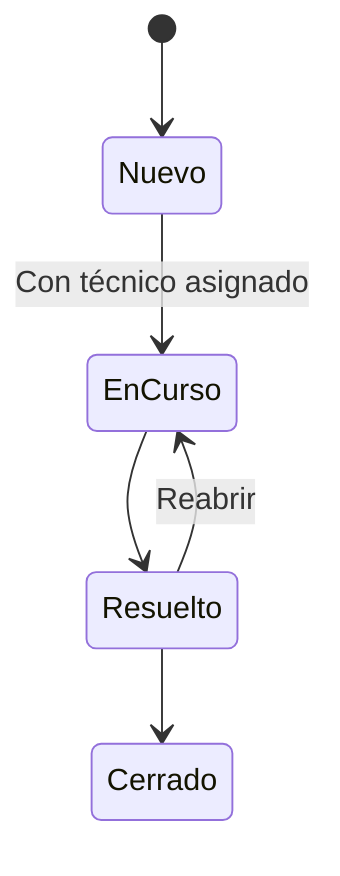

# Mesa de ayuda

Aplicación web de prueba para registrar solicitudes de soporte, asignarlas a un técnico y acompañar su resolución. Integra una interfaz MVC, autenticación, permisos por rol, persistencia y pruebas automatizadas.

[](https://github.com/HiroNk11/.NetProyects/actions/workflows/mesa-ayuda.yml)

## Qué resuelve

Un solicitante abre un ticket y agrega contexto mediante comentarios. El administrador asigna un responsable. El técnico registra el avance y resuelve el caso. Cada operación deja una entrada en el historial.

## Funcionalidades actuales

- Inicio y cierre de sesión con ASP.NET Core Identity y cookies.
- Tres roles: solicitante, técnico y administrador.
- Creación de tickets con título, descripción y prioridad.
- Bandeja con búsqueda por título o descripción, filtros y paginación de diez elementos.
- Resumen de tickets nuevos, en curso, resueltos y urgentes sin cerrar, limitado al acceso del usuario.
- Asignación y reasignación de responsables por el administrador.
- Comentarios y un historial de creación, asignación y cambios de estado.
- Control de versión para detectar ediciones simultáneas.
- SQLite local y SQL Server/Azure SQL, con migraciones independientes de EF Core.
- Aprovisionamiento inicial de cuentas mediante configuración privada.
- Diseño adaptable a escritorio y dispositivos móviles.

## Tecnologías

| Componente | Implementación |
| --- | --- |
| Plataforma | .NET 10, ASP.NET Core MVC |
| Interfaz | Razor y CSS, sin dependencias de JavaScript |
| Acceso | Identity, cookies, roles y protección antifalsificación |
| Persistencia | EF Core 10, SQLite y SQL Server/Azure SQL |
| Pruebas | xUnit, WebApplicationFactory y SQLite temporal |
| Integración continua | GitHub Actions: compilación, pruebas, cobertura y publicación de prueba |

## Ejecutar localmente

Requisito: **SDK .NET 10**. No requiere SQL Server ni Visual Studio.

Desde la raíz del repositorio:

```bash
cd Web/01-MesaAyuda
dotnet restore MesaAyuda.slnx
dotnet run --project src/MesaAyuda.Web --launch-profile MesaAyuda
```

Abrir [http://localhost:5180](http://localhost:5180).

El perfil `MesaAyuda` selecciona el entorno `Development`. Al iniciar, se aplican las migraciones pendientes y, si `Demo:Enabled` está activo, se crean las cuentas de demostración y cuatro tickets iniciales.

La base se guarda en `src/MesaAyuda.Web/App_Data/mesa-ayuda.db`, excluida de Git. Los cambios se conservan al reiniciar. Para una demostración nueva, se puede indicar una ruta de base diferente mediante `ConnectionStrings__Helpdesk`; su directorio debe existir.

### Cuentas de demostración

| Correo | Rol | Acceso |
| --- | --- | --- |
| `solicitante@mesa.local` | Solicitante | Crea tickets, consulta y comenta los propios |
| `tecnico@mesa.local` | Técnico | Atiende los asignados y puede crear solicitudes propias |
| `admin@mesa.local` | Administrador | Consulta todos, asigna técnicos y gestiona estados |

Contraseña de las tres cuentas: `Demo.Soporte2026!`.

Son credenciales públicas de prueba. La carga automática solo se ejecuta en `Development` con `Demo:Enabled=true`. En otro entorno no se crean estas cuentas, aunque la opción esté habilitada. Una base que ya contiene cuentas de demostración debe mantenerse separada de cualquier entorno real.

### Recorrido de demostración

1. Ingresar como solicitante y crear un ticket.
2. Cerrar sesión e ingresar como administrador.
3. Abrir el ticket y asignarlo al técnico.
4. Ingresar como técnico, pasarlo a **En curso** y agregar un comentario.
5. Marcarlo como **Resuelto**. Se puede reabrir o cerrar.
6. Ingresar como solicitante para consultar la conversación y el historial.

## Permisos y reglas

| Acción | Solicitante | Técnico | Administrador |
| --- | --- | --- | --- |
| Crear una solicitud propia | Sí | Sí | Sí |
| Ver o comentar un ticket | Propio | Propio o asignado | Cualquiera |
| Asignar responsable | No | No | Sí |
| Cambiar estado | No | Solo asignados | Cualquiera |

Un ticket cerrado no admite comentarios, cambios de estado ni reasignación. Para pasar un ticket nuevo a **En curso**, primero debe tener un técnico asignado. La prioridad se define al crear el ticket.



Los permisos se validan en el servidor. Una solicitud a un ticket ajeno devuelve 404; una acción no autorizada deriva a la pantalla de acceso restringido. Los formularios POST requieren token antifalsificación.

Cada modificación incrementa la versión del ticket. Una edición obsoleta devuelve 409 y requiere recargar el detalle. EF Core guarda el cambio, su comentario si corresponde y el evento de historial en una sola transacción. El control de concurrencia también cubre cambios confirmados por otra solicitud entre la lectura y la escritura.

Las fechas se guardan y muestran en UTC. La búsqueda utiliza coincidencias parciales; no normaliza tildes.

## Estructura

```text
src/MesaAyuda.Web/
  Controllers/   Entrada HTTP, validación y respuestas
  Models/        Entidades, estados y modelos de formulario
  Services/      Permisos y operaciones sobre tickets
  Data/          DbContext y carga de demostración
  Migrations/    Esquema versionado de la base de datos
  Views/         Páginas Razor
  wwwroot/css/   Presentación adaptable
tests/MesaAyuda.Tests/
  TransitionTests.cs       Reglas de cambio de estado
  TicketWorkflowTests.cs   Flujos HTTP, permisos y concurrencia
  HelpdeskFactory.cs       Servidor de prueba y base temporal
```

Las decisiones y sus límites están explicados en [arquitectura](docs/arquitectura.md).

## Pruebas y compilación

Desde `Web/01-MesaAyuda`:

```bash
dotnet build MesaAyuda.slnx -c Release
dotnet test MesaAyuda.slnx -c Release --logger trx --collect:"XPlat Code Coverage"
dotnet publish src/MesaAyuda.Web -c Release -o artifacts/app
```

Las pruebas HTTP usan el inicio de sesión real con Identity, cookies y tokens antifalsificación. Aplican las migraciones a una base SQLite temporal y comprueban explícitamente que no se use la base de la aplicación. Las claves de protección de datos de las pruebas son efímeras.

Se verifican acceso anónimo, cierre de sesión, redirecciones externas, creación y validación, protección CSRF, acceso a tickets ajenos, permisos, ciclo completo con reapertura y cierre, comentarios, codificación de HTML, conflictos de concurrencia, filtros y paginación.

El [workflow](../../.github/workflows/mesa-ayuda.yml) ejecuta la solución en Linux y conserva resultados TRX y cobertura como artefactos. Compilar o publicar el paquete no despliega la aplicación.

## Evolución del esquema

El manifiesto local fija la versión de `dotnet-ef`. Desde la carpeta de la solución:

```bash
dotnet tool restore
dotnet ef migrations add NombreDelCambio --context HelpdeskDbContext --project src/MesaAyuda.Web
dotnet ef database update --context HelpdeskDbContext --project src/MesaAyuda.Web
dotnet ef migrations add NombreDelCambioSql --context SqlServerHelpdeskDbContext --output-dir Migrations/SqlServer --project src/MesaAyuda.Web
```

Cada cambio del modelo requiere una migración por proveedor. Para operar con SQL Server, la herramienta toma `ConnectionStrings__Helpdesk` del entorno; sin esa variable usa LocalDB únicamente como valor de diseño. La aplicación aplica migraciones al inicio. Antes de un despliegue compartido, conviene mover ese paso al proceso de entrega con revisión y respaldo de datos.

## Desplegar en Azure

La [guía de despliegue](docs/despliegue-azure.md) explica cómo preparar App Service Windows, Azure SQL y las cuentas privadas. El script `scripts/publicar.ps1` genera el ZIP publicable. No incluye secretos ni la base local.

`Database:Provider` selecciona `SQLite` (predeterminado) o `SqlServer`. Este último requiere `ConnectionStrings:Helpdesk`. `Bootstrap:Enabled` permite crear un administrador y, opcionalmente, un técnico y un solicitante mediante variables privadas. Se deshabilita tras el primer acceso; no reemplaza contraseñas ni eleva los permisos de cuentas existentes.

## Alcance de esta versión

Es una aplicación funcional de demostración. Ofrece cuentas locales de prueba y aprovisionamiento inicial privado para el despliegue; no incluye altas de usuarios, recuperación de contraseña ni administración de roles desde la interfaz. Las opciones de asignación dependen de los técnicos existentes.

Tampoco incluye correo, adjuntos, SLA ni un despliegue público ya operativo. La guía utiliza la persistencia de claves predeterminada de App Service; otros alojamientos requieren configurarla. El historial se registra desde el servicio de tickets, pero no pretende ser un registro de auditoría inmutable frente a cambios directos en la base.

Para un equipo real hacen falta gestión del ciclo de vida de usuarios, respaldos, supervisión y revisión de permisos y despliegue. No se debe reutilizar la base de demostración. Las pruebas cubren los flujos con SQLite, la inicialización privada y la generación de migraciones SQL Server; falta ejecutar el recorrido contra el servicio Azure desplegado.

## Evolución del proyecto

Propuestas pendientes, aún no implementadas:

- [ ] Administración de usuarios, recuperación de acceso y confirmación de correo.
- [ ] Categorías, edición de prioridad y reglas de SLA.
- [ ] Notificaciones por correo mediante procesamiento en segundo plano.
- [ ] Adjuntos con validación de tipo, tamaño y acceso.
- [ ] Métricas de tiempo de respuesta y resolución.
- [ ] Exportación de reportes y búsqueda con normalización de tildes.
- [ ] Pruebas de interfaz automatizadas.
- [ ] Despliegue de demostración con configuración y almacenamiento persistentes.
- [ ] Automatizar pruebas de integración contra un servidor SQL Server y el despliegue de Azure.
