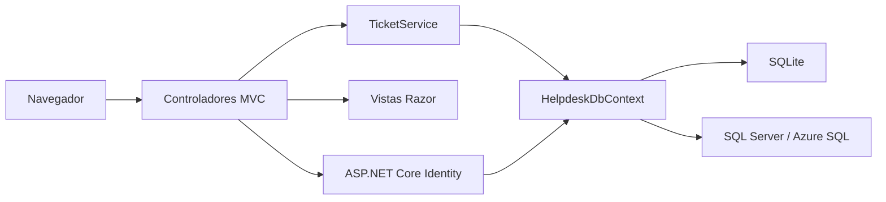

# Decisiones de arquitectura

## Una aplicación MVC con responsabilidades separadas

Los controladores reciben modelos de formulario específicos, validan la entrada y convierten el resultado del servicio en una respuesta HTTP. `TicketService` define el acceso a tickets y las operaciones permitidas. `HelpdeskDbContext` concentra la persistencia.

Se usa un solo proyecto de aplicación para mantener manejable este alcance. Las carpetas no se presentan como proyectos separados de Clean Architecture. Si crecen los casos de uso o aparecen otros consumidores, se puede extraer la lógica sin comenzar con una estructura más compleja.

## SQLite y EF Core

SQLite permite ejecutar la demostración sin instalar un servidor. Las relaciones, índices y el esquema de Identity se versionan con migraciones.

El servicio usa directamente EF Core: una capa de repositorios que solo repitiera sus métodos no aportaría valor al alcance actual. Las pruebas de integración usan el mismo proveedor relacional, para comprobar relaciones, transacciones y concurrencia.

SQLite tiene límites de escritura concurrente. Para Azure se usa SQL Server mediante un contexto derivado y migraciones independientes, seleccionados con `Database:Provider`. Ambos comparten el modelo y el servicio. Las pruebas generan el script SQL Server y detectan cambios del modelo sin migración; todavía no sustituyen una prueba contra un servidor real.

La inicialización privada crea roles y cuentas en una transacción. Valida todas las parejas de configuración antes de escribir, conserva contraseñas existentes y rechaza promociones de rol. Las contraseñas se proporcionan mediante variables privadas y se retiran después del primer acceso. La carga de datos demo sigue limitada a Development.

## Identidad y autorización

Identity administra hashes de contraseña, sesiones y bloqueo por intentos fallidos. MVC protege los formularios POST contra CSRF y Razor codifica el texto de usuarios antes de renderizarlo.

Los filtros de acceso se aplican antes de consultar un ticket y antes de paginar. Los contadores del tablero también se calculan sobre el conjunto visible del usuario. Ocultar controles en la interfaz complementa las verificaciones del servidor, sin reemplazarlas.

Las entradas de creación no incluyen propietario, técnico ni estado. El propietario se obtiene de la sesión y el ticket nace en estado Nuevo, evitando asignar campos arbitrarios enviados por el cliente.

## Consistencia y ediciones simultáneas

`Version` es un token de concurrencia administrado por la aplicación. Cada formulario envía la versión que vio el usuario. El servicio detecta versiones obsoletas y EF Core verifica nuevamente el token al guardar.

Cada operación agrega el evento de historial y ejecuta un solo `SaveChangesAsync`. Si una actualización concurrente gana, la transacción descarta tanto el comentario como el evento de la operación que perdió. Una prueba usa dos DbContext independientes para verificar ese caso.

## Pruebas HTTP con autenticación real

`WebApplicationFactory` ejecuta la aplicación y permite enviar solicitudes sin abrir un puerto. Las pruebas inician sesión con Identity y envían el token antifalsificación extraído del formulario.

La configuración de conexión se resuelve al crear el DbContext, para permitir sustituirla en el host de pruebas. La fábrica verifica que la base esté en una ruta temporal antes de aplicar migraciones o insertar datos. Las claves efímeras son exclusivas del host de pruebas.

## Próximas decisiones

- Separar el envío de notificaciones de la transacción principal mediante una cola o un outbox.
- Definir retención, acceso y almacenamiento de adjuntos.
- Diseñar métricas a partir del historial sin confundir reaperturas con primeras resoluciones.
- Elegir una estrategia de aprovisionamiento de usuarios antes de abrir la aplicación a un equipo real.
